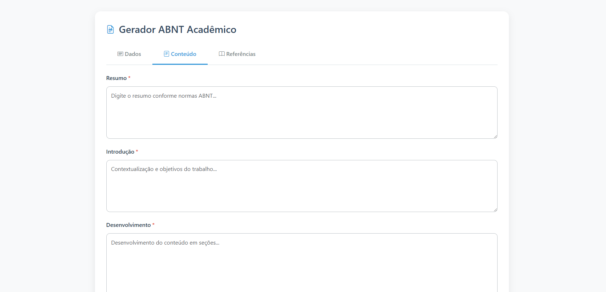
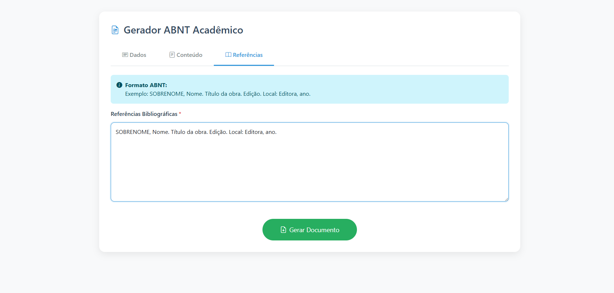

# 📚 Academic Formatter ABNT


Ferramenta web para formatação automática de trabalhos acadêmicos conforme normas ABNT, gerando documentos .docx prontos para uso.






## ✨ Funcionalidades

- **Formulário Inteligente**
  - Campos para todas as seções acadêmicas
  - Validação em tempo real
  - Botão habilitado progressivamente

- **Formatação Automática**
  - Configuração completa de margens
  - Fonte Arial 12 com espaçamento 1.5
  - Capa, resumo e referências formatados

- **Exportação Simplificada**
  - Geração de .docx com um clique
  - Nomeação automática por data
  - Compatível com Microsoft Word e LibreOffice

## 🛠 Tecnologias

- **Backend:** Python + Flask
- **DOCX:** python-docx
- **Frontend:** Bootstrap 5 + Ícones
- **Validação:** JavaScript Vanilla

## 🚀 Instalação

1. Clone o repositório:
```bash
git clone https://github.com/inojoza28/ABNT.git
